#WDI-HW Submission Process

###Open up a terminal window

######Move to your local `WDI_NYC_12` folder

```bash
cd dev/wdi/WDI_NYC_12
```

######Move to the folder for today and look at what is inside

```bash
cd w01
cd d01
ls
```
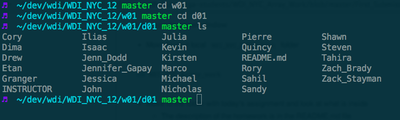

######Move to your __OWN PERSONAL DIRECTORY__ and do the work
- Do NOT edit any files that are not in your personal directory
- You can find any assignments in your personal directory
- Do the work!
- Remember to save all your files

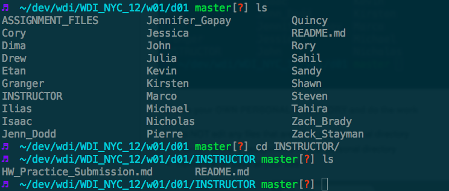
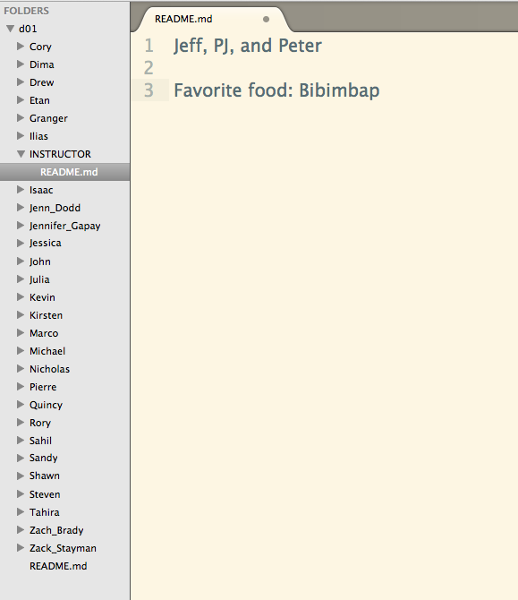


######Check status and add files to the stage

```bash
git status
git add .
git status
```

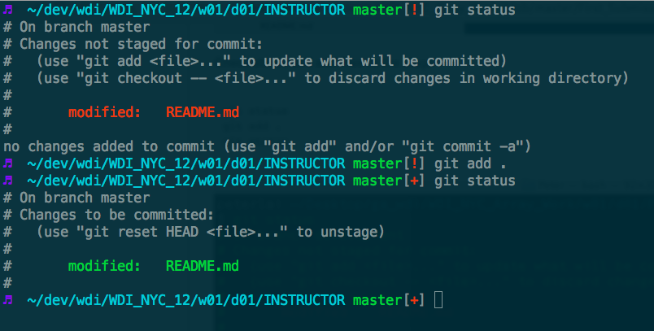


######Commit changes and push to Github

```bash
git commit -m "Complete HW 01-01"
git push origin master
```

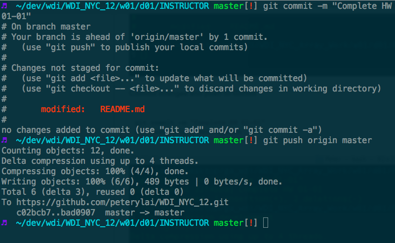


###Open up a your internet browser and go to your fork on Github

######Make ONE pull request

---

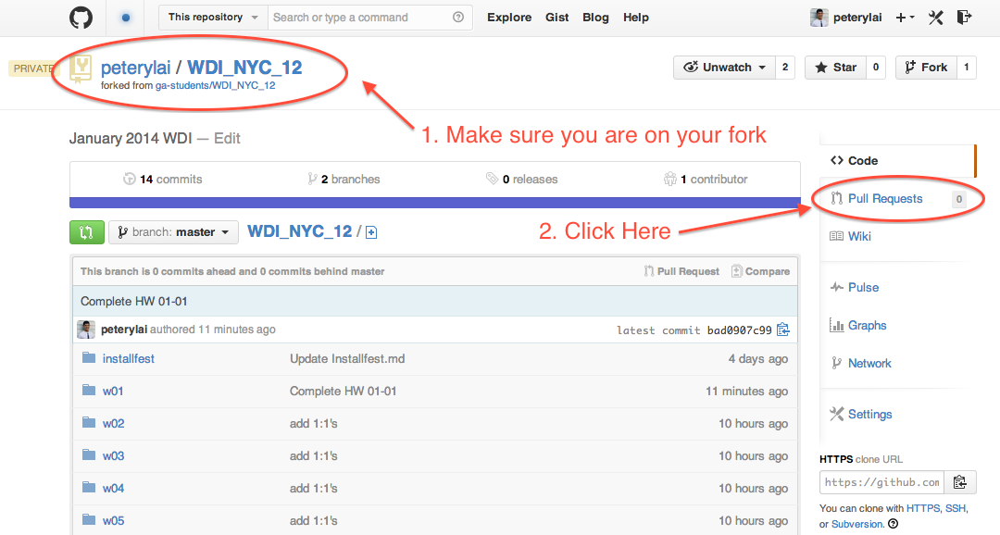

---

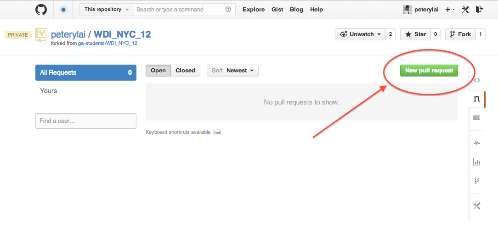

---

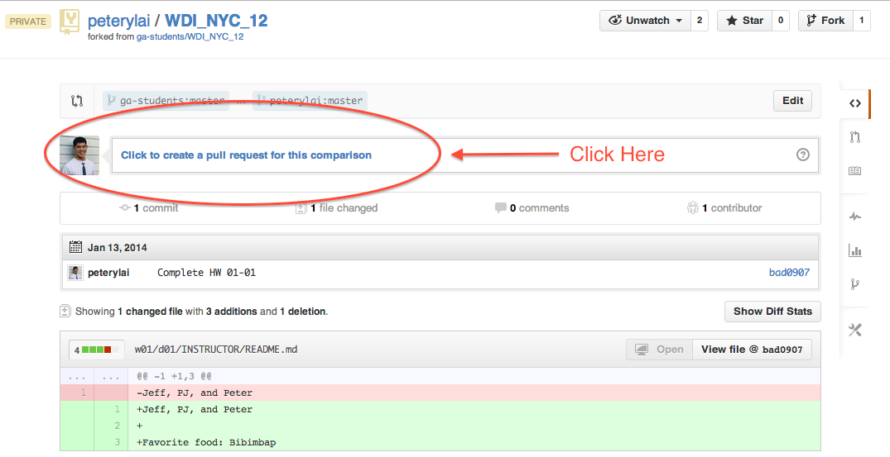

---
###### Make your pull request
- Title your pull request with the week and day (for example `Complete HW 01-01`)
- In the "write" section identify how much of the work you were able to complete ( 1 - 5 scale with 5 being 100% done) and how comfortable you are with the material ( 1 - 5 scale with 5 being understand everything).
- It MUST be in the following format, so copy and paste the below if it helps. Please do not add any other text in this field.

```
{
  "completeness": "3",
  "comfortability": "2"
}
```

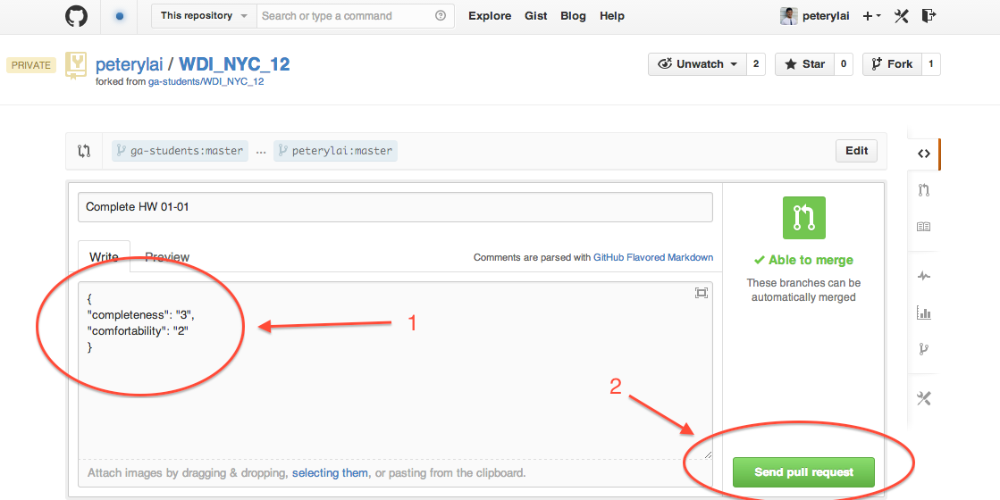

---


- If you have other comments you can add them in the comments section after the pull request has been made

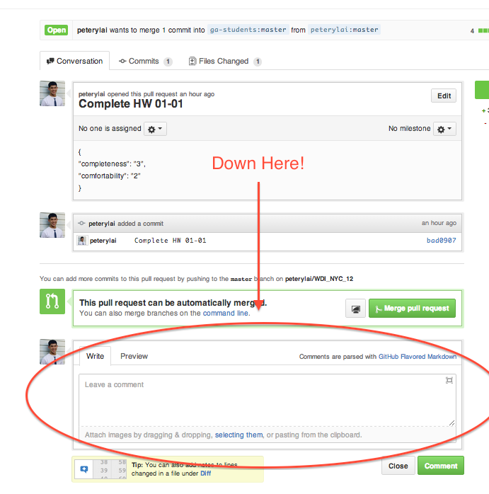

---

You're DONE!

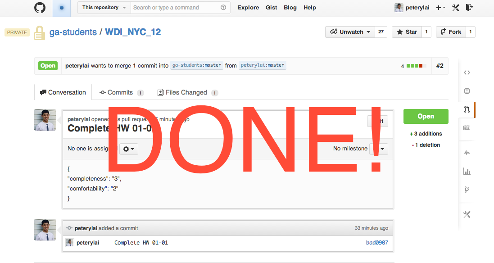
