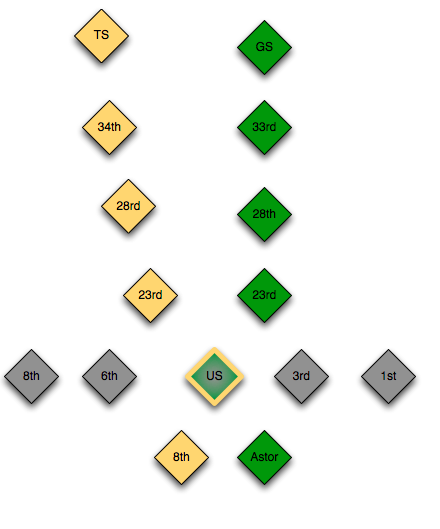

#MTA App

###Prompt:
- Work in pairs
- You will be creating a program that models a simple subway system.

- The program takes the line and stop that a user is getting on at and the line
and stop that user is getting off at and prints the total number of stops for the trip.
- There are 3 subway lines:
  - The N line has the following stops: Times Square, 34th, 28th, 23rd, Union Square, and 8th
  - The L line has the following stops: 8th Ave, 6th Ave, Union Square, 3rd Ave, and 1st Ave
  - The 6 line has the following stops: Grand Central, 33rd, 28th, 23rd, Union Square, and Astor Place.
  - All 3 subway lines intersect at Union Square, but there are no other intersection points.
    - For example, this means the 28th stop on the N line is different than the 28th street stop on the 6 line, so you'll have to differentiate this.

#####Commit 1
- One line functionality
  - Assume that the N line is the only subway line first.
  - The user should be given a list of all the stops on the N line
  - The user should be able to enter the stop that they want to get on at
  - The user should be able to enter the stop that they want to get off at
  - The user should be told the number of stops for their trip

#####Commit 2
- Two lines functionality (N and L)
  - The user should be asked what line they want to get on
  - The user should be given a list of all the stops on that line
  - The user should be able to enter the stop that they want to get on at
  - The user should be asked what line they want to get off
  - The user should be given a list of all the stops on that line
  - The user should be able to enter the stop that they want to get off at
  - The user should be told the number of stops for their trip

#####Commit 3
- Three lines functionality (N, L and 6)
  - Add functionality for the 6 line

#####Commit 4 (Bonus)
- Add functionality for a fourth line, the 1 line
  - The 1 line has the following stops: 59th, 50th, Times Square, 34th, 28th
  - It intersects with the N line at Times Square
  - There are no other intersection points between the 1 line and any other line

### Hints:
* Consider diagraming the lines by sketching out the subway lines and their stops and intersection. [NYC Subway map](http://www.mta.info/maps/submap.html)

 

* Make the name of the subway lines keys in a hash, while the values are an array of all the stops on each line.
* 
```ruby
n = ['ts', '34th', '28th-n', '23rd-n', 'us']
l = ['8th', '6th', 'us', '3rd', '1st']
s = ['gc', '33rd', '28th-s', '23rd-s', 'us']
mta = {}
mta[:n] = n
mta[:l] = l
mta[:s] = s
```

* The key to the lab is to find the __intersection__ of the lines at Union Square.
* Make sure the stops that are the same for different lines have different names (i.e. 23rd on the N and on the 6 need to be differentiated)

